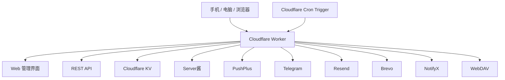

# ⏰ Task Reminder

> 一个部署在 **Cloudflare Workers + KV** 上的轻量级个人任务提醒系统。  
> 不需要自建服务器，浏览器即可管理任务；支持周期提醒、单次提醒、公历/农历、多渠道通知、自动续订、冻结/回收站，以及 WebDAV 智能备份与恢复。

<p align="center">
  
  
  
  
  
</p>

---

## ✨ 项目简介

Task Reminder 是一个面向个人使用的任务提醒与自动续订系统。

它直接运行在 Cloudflare Workers 上，任务、配置、提醒状态和日志保存在 Cloudflare KV 中，由 Cloudflare Cron Trigger 周期执行检查。因此即使手机关机、浏览器关闭或更换设备，提醒任务仍然可以继续运行。

适合管理：

- 📱 手机卡、Google Voice、域名等周期保号 / 续期
- 💳 信用卡、会员、订阅、账单到期
- 🎂 生日、纪念日、农历日期
- 🧾 月度、季度、年度固定事项
- ⏳ 临时单次提醒
- 🔁 到期后自动进入下一周期的长期任务

项目没有独立前端工程，也不需要额外数据库服务。Web 页面、REST API、Cron、提醒计算和通知逻辑都在一个 Worker 中完成。

---

## 🚀 核心功能

### 📅 灵活的任务模式

支持：

- **周期任务**
  - 分钟
  - 小时
  - 天
  - 周
  - 月
  - 年
- **单次提醒**
- **公历日期**
- **农历日期**
- **自定义提醒时间**
- **多组提前提醒**
- **手动续订**
- **自动续订**

例如：

```text
Google Voice 保号
每 85 天一次

提前提醒：
7 天
3 天
1 天

到期提醒成功后：
自动进入下一周期
```

系统保留任务续订历史，便于查看之前的续订时间。

---

### 🔔 多渠道通知

当前支持：

| 渠道 | 用途 |
|---|---|
| Server酱 | 微信通知 |
| PushPlus | 微信通知 |
| Telegram Bot | Telegram 消息 |
| Resend | 邮件通知 |
| Brevo | 邮件通知 |
| NotifyX | 聚合通知 |

可以同时启用多个渠道。

每个提醒点会分别保存各渠道的发送结果：

- 成功渠道不会重复发送
- 失败渠道在后续 Cron 周期继续尝试
- 单渠道设置最大重试次数
- 下一周期使用新的提醒状态，不会被上一周期影响

---

### ❄️ 任务冻结 / 解冻

暂时不需要提醒、但又不想删除任务时，可以直接冻结。

冻结后暂停：

- 提前提醒
- 到期提醒
- 失败重试
- 自动续订

任务本身的日期、周期和配置不会被删除。

解冻时会根据任务当前状态处理，避免错误补发很久以前已经过期的提醒。

---

### ♻️ 30 天回收站

普通删除不会立即永久清除任务，而是先进入回收站。

- 默认保留 30 天
- 回收站中的任务不参与提醒
- 不参与失败重试
- 不参与自动续订
- 支持恢复
- 支持彻底删除
- 支持清空回收站

---

### 📊 状态面板

首页显示：

- 📋 总任务
- ⚠️ 已过期
- ⏳ 即将到期
- ✅ 进行中
- ❄️ 已冻结
- 🕒 下次检查时间

任务卡片会展示下一次提醒时间、提醒规则和当前状态。

---

### 📨 推送日志

内置推送日志，可用于检查：

- 是否触发提醒
- 哪个渠道成功
- 哪个渠道失败
- 是否处于重试状态

配置页面也支持直接测试通知渠道。

---

## 💾 WebDAV 智能备份

当前远端备份使用 **通用 WebDAV**。

可配置：

```text
WebDAV 地址
备份目录
用户名
密码 / 应用密码
```

默认备份目录：

```text
TaskReminderBackup
```

可用于坚果云、Nextcloud、ownCloud 或其他兼容 WebDAV 的服务。

### 备份分两类

**任务数据**

- 正常任务
- 冻结任务
- 回收站任务
- 续订历史

**配置 / Key**

- 系统配置
- 已启用通知渠道
- 对应 Token / API Key

以下内容不会写入普通备份：

- WebDAV 连接用户名和密码
- `jwtSecret`
- `done_*`
- `retry_*`
- `autorenew_*`
- 其他运行时临时状态

### 智能备份规则

自动备份不是每次都重复写一份完整数据，而是根据变化分类：

```text
任务变化
   ↓
只更新任务备份

配置 / Key 变化
   ↓
只更新配置 / Key 备份

两类都变化
   ↓
分别更新

完全没有变化
   ↓
不生成重复历史
```

任务和配置 / Key 的历史版本分别维护，各自最多保留 **20 份**。

列表会自动合并同一次操作产生的“最新状态文件 + 历史文件”重复显示：

- 最新一份显示 `⭐ 最新备份`
- 同一份内容不会在页面看起来像两份不同备份
- 较旧备份继续作为历史版本显示
- 真正有更新但尚未产生历史版本的最新状态仍会单独显示

恢复时系统会先读取备份内容，再让用户选择恢复：

- 任务数据
- 系统配置
- 通知 Key

恢复采用合并方式，不会无条件清空现有任务。

---

## 🧩 系统架构



项目目录：

```text
task-reminder-main/
├── index.js
├── wrangler.toml
├── package.json
├── README.md
└── .gitignore
```

其中：

- `index.js`：Worker 后端、页面、API、Cron 和主要业务逻辑
- `wrangler.toml`：Cloudflare Worker、KV、Cron 配置
- `package.json`：Wrangler 依赖与部署命令
- `README.md`：项目介绍与部署教程

---

## 🛠 技术栈

- **Cloudflare Workers**
- **Cloudflare Workers KV**
- **Cloudflare Cron Triggers**
- **Vanilla JavaScript**
- **HTML / CSS**
- **WebDAV**

不需要：

- VPS
- MySQL / PostgreSQL
- Redis
- 独立前端服务器
- Docker

---

# 🚀 部署教程

下面提供两种方式：

1. **Wrangler CLI 部署**
2. **GitHub + Cloudflare 自动部署**

第一次部署建议先完整看一遍“KV”和“安全变量”部分。

---

## 1. 准备

需要：

- Cloudflare 账号
- GitHub 账号（仅 GitHub 自动部署时需要）
- Node.js / npm（Wrangler CLI 部署时需要）

项目当前使用 Wrangler 4。

安装依赖：

```bash
npm install
```

---

## 2. 创建 Cloudflare KV

### 方法 A：Cloudflare 中文控制台

进入 Cloudflare：

```text
存储和数据库
→ Workers KV
→ 创建命名空间
```

创建：

```text
TASKS_KV
```

名称本身可以自定义，但 Worker 中的**绑定变量名必须是**：

```text
TASKS_KV
```

因为源码通过：

```js
env.TASKS_KV
```

访问数据库。

### 方法 B：Wrangler

```bash
npx wrangler login
npx wrangler kv namespace create TASKS_KV
```

创建成功后会得到一个 KV Namespace ID。

如果采用全新的 Wrangler / GitHub 部署，需要在你自己的 `wrangler.toml` 中为绑定补上该 ID：

```toml
[[kv_namespaces]]
binding = "TASKS_KV"
id = "你的_KV_NAMESPACE_ID"
```

> KV Namespace ID 不是密码，但它属于你自己的 Cloudflare 资源标识。公开模板仓库通常不直接填写作者自己的 ID。

---

## 3. Worker 配置

项目的核心配置类似：

```toml
name = "task-reminder"
main = "index.js"
compatibility_date = "2026-07-15"
keep_vars = true

[[kv_namespaces]]
binding = "TASKS_KV"

[triggers]
crons = ["*/5 * * * *"]
```

全新部署时，请按上一节把自己的 KV ID 配好，或者在 Cloudflare Worker 的 Bindings 页面把 `TASKS_KV` 绑定到刚创建的 KV。

Cloudflare 中文界面通常可以在：

```text
计算
→ Workers 和 Pages
→ 选择你的 Worker
→ 设置
→ 绑定
→ 添加绑定
→ KV 命名空间
```

添加：

```text
变量名：TASKS_KV
KV：选择刚创建的 TASKS_KV
```

---

## 4. 必须配置的安全变量

生产环境至少设置：

```text
DEFAULT_USERNAME
DEFAULT_PASSWORD
JWT_SECRET
```

用途：

| 变量 | 用途 |
|---|---|
| `DEFAULT_USERNAME` | 管理后台用户名 |
| `DEFAULT_PASSWORD` | 管理后台密码 |
| `JWT_SECRET` | 登录令牌签名密钥 |

不要继续使用源码中的开发兜底值。

### Cloudflare 中文控制台设置

进入：

```text
计算
→ Workers 和 Pages
→ 你的 Worker
→ 设置
→ 变量和机密
```

添加：

```text
DEFAULT_USERNAME
DEFAULT_PASSWORD
JWT_SECRET
```

推荐：

- `DEFAULT_USERNAME`：普通变量或 Secret 均可
- `DEFAULT_PASSWORD`：Secret
- `JWT_SECRET`：Secret

`JWT_SECRET` 建议使用随机生成的长字符串。

### Wrangler 设置 Secret

```bash
npx wrangler secret put DEFAULT_PASSWORD
npx wrangler secret put JWT_SECRET
```

---

# 方法一：Wrangler CLI 部署

## 5. 登录 Cloudflare

```bash
npx wrangler login
```

浏览器会打开 Cloudflare 授权页面。

---

## 6. 确认 KV ID 已写入

例如：

```toml
[[kv_namespaces]]
binding = "TASKS_KV"
id = "xxxxxxxxxxxxxxxxxxxxxxxxxxxxxxxx"
```

否则全新环境的 Wrangler 部署无法知道应该连接哪个 KV Namespace。

---

## 7. 部署

```bash
npm run deploy
```

等价于：

```bash
npx wrangler deploy
```

成功后会得到类似：

```text
https://task-reminder.<你的子域>.workers.dev
```

打开即可看到登录页。

---

# 方法二：GitHub + Cloudflare 自动部署

这种方式适合长期维护。以后只要向 GitHub 推送代码，Cloudflare 就自动部署。

## 8. 上传到 GitHub

新建 GitHub 仓库，把项目根目录中的文件上传：

```text
index.js
wrangler.toml
package.json
README.md
.gitignore
```

不要上传：

```text
node_modules/
.wrangler/
.env
包含真实密码、Token、API Key 的临时文件
```

如果你准备公开仓库，务必检查：

- 没有真实管理员密码
- 没有真实 `JWT_SECRET`
- 没有 Server酱 / PushPlus / Telegram 等 Token
- 没有 WebDAV 密码
- 没有个人备份文件

---

## 9. Cloudflare 导入 GitHub 仓库

Cloudflare 当前支持直接把 GitHub 仓库连接到 Workers。

进入：

```text
计算
→ Workers 和 Pages
→ 创建应用程序
→ 导入存储库 / Import a repository
```

授权 Cloudflare 访问 GitHub 后：

1. 选择仓库
2. 选择生产分支，例如 `main`
3. 保存并部署

这个项目没有前端编译步骤。

部署命令可以使用：

```text
npx wrangler deploy
```

如果 Cloudflare 页面提供 Build command，可以保持为空或按平台默认配置。

---

## 10. GitHub 自动部署后绑定 KV

选择部署出的 Worker：

```text
设置
→ 绑定
→ 添加
→ KV Namespace
```

绑定：

```text
变量名：TASKS_KV
命名空间：你创建的 TASKS_KV
```

如果仓库里的 `wrangler.toml` 已经填写你自己的 KV ID，则应保持两边指向同一个 Namespace。

不要误绑定到一个新的空 KV，否则登录后可能表现为：

```text
任务全部消失
配置全部为空
历史记录为空
```

实际上数据并没有消失，而是 Worker 连到了另一套 KV。

---

## 11. 设置安全变量

仍然进入：

```text
Worker
→ 设置
→ 变量和机密
```

配置：

```text
DEFAULT_USERNAME
DEFAULT_PASSWORD
JWT_SECRET
```

然后重新部署或重启最新版本。

---

## 12. GitHub 后续更新

GitHub 与 Worker 连接后，向生产分支推送新提交即可触发 Cloudflare Builds。

例如：

```bash
git add .
git commit -m "update task reminder"
git push
```

之后可以在：

```text
Worker
→ 部署 / Builds
```

查看构建和部署状态。

---

# ⏱ Cron 与提醒检查

当前 `wrangler.toml`：

```toml
[triggers]
crons = ["*/5 * * * *"]
```

表示 Cloudflare 每 **5 分钟**唤醒 Worker 一次。

页面中的 `checkInterval` 是在 Cron 已经触发后再进行二次判断，因此默认 Cron 下建议使用：

```text
5
10
15
20
30
60
```

分钟。

例如页面设置为 3 分钟，但 Cron 仍然每 5 分钟运行一次，就不可能真正做到每 3 分钟检查。

如果确实需要 1 分钟粒度，可以把 Cron 改为：

```toml
[triggers]
crons = ["* * * * *"]
```

然后再通过页面的 `checkInterval` 控制实际检查频率。

---

# 🔔 首次使用

部署完成后建议按这个顺序测试：

1. 访问 Worker 地址
2. 使用 `DEFAULT_USERNAME` / `DEFAULT_PASSWORD` 登录
3. 打开“配置”
4. 选择一个通知渠道
5. 填写对应 Token / API Key
6. 点击“测试推送”
7. 新建一个几分钟后的测试任务
8. 等待 Cron 触发
9. 查看“推送日志”
10. 确认提醒成功后再建立长期任务
11. 最后配置 WebDAV 备份
12. 手动备份一次并尝试读取备份列表

---

# 🔧 通知渠道配置

## Server酱

填写：

```text
SendKey
```

## PushPlus

填写：

```text
Token
```

## Telegram

填写：

```text
Bot Token
Chat ID
```

## Resend

填写：

```text
API Key
发件邮箱
收件邮箱
```

## Brevo

填写：

```text
API Key
已验证发件邮箱
收件邮箱
```

## NotifyX

填写：

```text
API Key
```

配置完成后建议逐个执行“测试推送”。

---

# 💾 WebDAV 配置

打开：

```text
备份与恢复
```

填写：

```text
WebDAV 地址
备份目录
用户名
密码 / 应用密码
```

以坚果云为例，WebDAV 地址通常类似：

```text
https://dav.jianguoyun.com/dav/
```

具体地址、用户名和应用密码以你的 WebDAV 服务商后台为准。

建议：

- 使用应用密码，不使用主账号密码
- 单独建立 `TaskReminderBackup` 目录
- 第一次先点击“测试连接”
- 测试通过后再开启自动备份

---

# 📦 KV 数据说明

Task Reminder 的主要数据都在 `TASKS_KV`。

常见 Key：

```text
task_<id>                  正常任务
trash_<id>                 回收站任务
history_<id>               续订历史

config                     系统配置

push_logs                  推送日志

done_<提醒点>              已成功提醒状态
retry_<提醒点>             失败渠道重试状态
autorenew_<任务/周期>      自动续订状态

backup_hash_tasks          任务备份内容哈希
backup_hash_config         配置备份内容哈希
backup_history_last_tasks  最近任务历史备份时间
backup_history_last_config 最近配置历史备份时间
```

因此：

> **换一个 KV Namespace，等同于换了一套数据库。**

升级项目时不要随意删除整个 `TASKS_KV`。

---

# 🔐 安全建议

公开部署前至少检查：

1. 修改默认管理员账号和密码
2. 使用随机高强度 `JWT_SECRET`
3. 不要把真实 Token / API Key 写进 GitHub
4. 不要把 WebDAV 密码写进源码
5. GitHub 仓库中不要提交 `.env`
6. Cloudflare 账号开启两步验证
7. WebDAV 尽量使用独立应用密码
8. 定期确认备份是否能正常读取
9. 不要为了“清理”而直接删除整个 KV Namespace

通知 Token、API Key 和部分系统配置会保存在 Cloudflare KV 的 `config` 中，因此 Cloudflare 账号和 KV 本身也应按敏感数据管理。

---

# 🧪 本地开发

安装依赖：

```bash
npm install
```

启动本地开发：

```bash
npx wrangler dev
```

注意：

本地 Wrangler 默认可能使用本地模拟存储，不等于生产 KV。测试生产数据前请先了解 Wrangler 的本地 / 远端资源行为，避免误操作正式数据。

部署：

```bash
npx wrangler deploy
```

---

# 🛠 常见问题

## 登录后什么都没有

检查：

1. Worker 是否绑定 `TASKS_KV`
2. 是否绑定到了原来的 KV Namespace
3. 正式环境和预览环境是否用了不同 KV

---

## 到时间没有提醒

依次检查：

1. Cron Trigger 是否正常
2. `wrangler.toml` 是否仍有 Cron
3. `checkInterval` 是否与 Cron 实际频率匹配
4. 任务是否被冻结
5. 任务是否已经进入回收站
6. 通知渠道是否启用
7. Token / API Key 是否有效
8. “测试推送”能否成功
9. “推送日志”中具体报什么错误

---

## 某个通知渠道重复推送

正常情况下，成功渠道会写入 `done_*` / `retry_*` 状态并避免重复发送。

如果出现重复，重点检查：

- 是否切换过 KV
- 是否手工删除了提醒状态 Key
- 是否同时运行多套 Worker
- 是否建立了重复任务

---

## WebDAV 备份失败

检查：

1. WebDAV 地址
2. 用户名
3. 密码 / 应用密码
4. 远端目录权限
5. 是否可以创建和删除文件
6. “测试连接”的具体 HTTP 错误

---

## 为什么备份列表以前看起来有两份一样的？

系统内部为了兼顾“最新可恢复状态”和“历史版本”，一次手动备份可能同时产生：

```text
latest 文件
history 文件
```

两者可能内容完全相同。

当前界面已经优化：

- 内容大小一致、写入时间接近的同一次备份会合并显示
- 只显示一条
- 用 `⭐ 最新备份` 标记
- 较旧历史仍正常保留

内部文件仍分别维护，不影响自动备份和恢复机制。

---

# 📌 当前版本功能

- [x] 周期提醒
- [x] 分钟 / 小时 / 天 / 周 / 月 / 年
- [x] 单次提醒
- [x] 公历日期
- [x] 农历日期
- [x] 多组提前提醒
- [x] 多渠道通知
- [x] 通知失败重试
- [x] 防重复通知
- [x] 手动续订
- [x] 自动续订
- [x] 冻结 / 解冻
- [x] 30 天回收站
- [x] 推送日志
- [x] WebDAV 备份
- [x] 智能分类自动备份
- [x] 两类历史独立保留
- [x] 最新备份去重显示
- [x] 备份自动检测与选择恢复
- [x] 手机端适配
- [x] 桌面端适配

---

# 🤝 二次开发

项目结构比较简单，适合直接 Fork。

继续修改时建议重点保护以下逻辑：

- KV Key 结构
- 提醒时间计算
- 防重复发送状态
- 失败重试
- 自动续订
- 农历换算
- 备份格式兼容

新增字段尽量采用向后兼容的方式，避免旧任务和旧备份无法读取。

---

# 📄 License

MIT License。

---

<p align="center">
  <b>Task Reminder</b><br>
  一个轻量、可自托管、适合长期运行的个人任务提醒系统。
</p>
